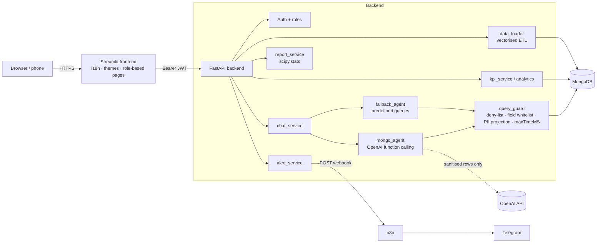

# Hospital Susana López de Valencia — Operations Intelligence

Conversational AI agent, KPI dashboard, automatic alerts (Telegram through n8n) and
inferential-statistics reports built on the hospital's HIS extract (`DateBaseHIS.xlsx`).
Hackathon FUP 2026 — *Transformando datos en decisiones*.

> **Live demo:** `https://<your-frontend-url>` · **API docs:** `https://<your-backend-url>/docs`
> (replace after deploying; see [Deployment](#deployment)).

---

## 1. Problem and solution

The hospital's data lives in seven HIS tables that only technical staff can query.
Managers need to know, in seconds, how many beds are free, which medications will run out
and where patients wait too long.

| Challenge requirement | Implementation |
|---|---|
| Conversational agent (NL → query) | `POST /api/chat` (alias `POST /api/query`): OpenAI function calling → validated MongoDB query → answer in plain Spanish/English. Conversation memory for follow-ups. |
| Plan B without AI | Keyword intents → predefined queries (`fallback_agent.py`), used automatically when OpenAI is not configured or fails. |
| Dashboard | Occupancy (now + daily trend), waiting time by triage and shift, surgeries performed vs scheduled, demand by specialty/area, top and lowest-turnover medications, low stock, de-identified patient table, filters by date/service/specialty. |
| Data loading | Admin-only upload of the `.xlsx`; vectorised ETL (~10 s transform) with encoding repair and stale-record removal. |
| Recommendations / predictive alerts | Rule engine (occupancy, stock-outs, ER waits, triage 2 target, surgery completion) + trend detection with a one-week forecast. |
| Alert management | Sliding alert bar at the top of Home and Dashboard (counts by severity + one short line per alert). Workflow per alert: *nueva → revisada → en progreso → finalizada*, with who/when/note; finalized and auto-resolved alerts move to a searchable history. |
| Reports | Generated **on demand**: the user picks the analyses and only those are computed (each cached per dataset). Conclusions downloadable as Markdown. |
| Billing (optional) | Admin-only module (`BILLING_ENABLED`): billable services/medications by insurer, regime, month and item; estimated amounts when `BILLING_TARIFFS` is configured. |
| Telegram | New alerts and workflow changes are POSTed to an n8n webhook, which sends them to Telegram. |
| Security | JWT auth with `admin`/`user` roles, **strictly read-only AI agent** (input screen + whitelists + read-only DB facade + optional read-only Mongo user), mandatory PII projection, maxTimeMS, upload limits, no secrets in the repo. Generated queries are never shown to any role. |
| Performance | Per-ETL-run in-memory caches (KPIs, alerts, report sections, billing, prompts, repeated chat questions) with single-flight loading, pandas work off the event loop, concurrent Mongo reads and n8n calls, gzip responses. |
| Accessibility | Floating top-right menu with Spanish/English switch and light / dark / high-contrast themes; text size follows the browser zoom. Atkinson Hyperlegible font, colour-blind-safe charts, responsive layout. |

## 2. Architecture



**MongoDB collections** (English, snake_case): `admissions` (one embedded document per
admission with patient, triage, bed, diagnosis, services[], medications[],
scheduled_surgeries[] and derived fields), `bed_capacity`, `inventory` (synthetic stock),
`medication_usage_daily`, `service_demand_daily`, `metadata`, `users`, `alerts`,
`conversations` (24 h TTL), `agent_logs`.

## 3. Technology choices

| Technology | Why |
|---|---|
| **FastAPI** | Async, typed, automatic OpenAPI docs for the jury; dependency injection makes auth/roles explicit. |
| **MongoDB + NL2MQL** (instead of the suggested SQLite + NL2SQL) | The HIS is a deep one-to-many hierarchy (one admission → up to 1,600 services and medications). Embedding it gives one document per clinical episode, so most questions need no joins. More importantly for safety, an aggregation pipeline is **structured JSON**: the backend walks it as a tree, blocks operators at any depth, checks every field against a whitelist and appends a PII projection. Doing the same reliably with free SQL text requires a full SQL parser. OpenAI function calling also returns JSON natively. Trade-off: LLMs know SQL slightly better than MQL — mitigated with a schema catalogue, real categorical values, few-shot examples, validation feedback with one retry, and Plan B. |
| **pandas + scipy** | Vectorised ETL and analytics; `scipy.stats` for confidence intervals, Mann-Whitney U, Welch t-test, Kruskal-Wallis, Spearman and linear regression. |
| **OpenAI (gpt-4o, configurable)** | Function calling gives structured queries; the model is only sent the schema and sanitised aggregate rows. |
| **Streamlit** | Fast to build, Python end-to-end; extended with CSS for accessibility and responsiveness. |
| **n8n** | Low-code routing of alerts to Telegram (or e-mail, Teams…) without putting bot tokens in the backend. |

## 4. Run it

### Docker (recommended)

```bash
cp .env.example .env            # then edit: JWT_SECRET, BOOTSTRAP_ADMIN_PASSWORD, OPENAI_API_KEY (optional)
docker compose up -d --build
# First data load: sign in as admin at http://localhost:8501 → "Carga de datos" → upload DateBaseHIS.xlsx
# (or copy it into the volume and reprocess:)
docker compose cp DateBaseHIS.xlsx backend:/app/app/data/DateBaseHIS.xlsx
```

Frontend: http://localhost:8501 · API docs: http://localhost:8000/docs

### Local (without Docker)

```bash
# MongoDB running on localhost:27017
cd backend
python -m venv .venv && source .venv/bin/activate      # Windows: .venv\Scripts\activate
pip install -r requirements-dev.txt
cp ../.env.example .env                                  # edit values
# put DateBaseHIS.xlsx in backend/app/data/
python -m app.scripts.load_data                          # ETL
python -m app.scripts.create_admin --email admin@hospital.local   # if BOOTSTRAP_ADMIN_PASSWORD is empty
uvicorn app.main:app --reload

cd ../frontend
python -m venv .venv && source .venv/bin/activate
pip install -r requirements.txt
API_BASE_URL=http://localhost:8000/api streamlit run app.py
```

### Tests

```bash
cd backend
pytest                                   # in-memory mongomock
TEST_MONGO_URI=mongodb://localhost:27017 pytest   # against a real MongoDB (recommended)
```

`tests/test_demo_questions.py` has one test per official demo question, plus follow-up and
English variants. `test_query_guard.py` covers injection attempts (`$where`, `$function`,
`$lookup`, `$unionWith`, `$$ROOT`, PII aliasing…).

## 5. Official demo questions (expected results on the provided dataset)

Reference date = last admission in the data: **2026-09-21 14:33**.

| # | Question | Expected answer |
|---|---|---|
| 1 | ¿Cuántas camas de UCI están ocupadas hoy? | **32 of 46** ICU beds (**69.6 %**) |
| 2 | ¿Cuáles son los medicamentos con menos de 5 días de inventario? | **54** items, led by metronidazol 500 mg (0.6 days) and trimetoprim-sulfametoxazol (0.8 days) — *synthetic stock, seed 20260921* |
| 3 | ¿Cuál es el tiempo de espera promedio en urgencias en la última semana? | **59.7 min** (840 ER patients, 14–21 Sep) |
| 4 | ¿Qué servicio tiene más pacientes ingresados este mes? | **URGENCIAS** with **1,169** admissions (1–21 Sep), then Pediatría 409 and Hospitalización 401 |

Follow-up example: after Q1, *“¿y en pediatría?”* → 83 of 92 beds (90.2 %).

## 6. Roles and access

| Capability | user | admin |
|---|:-:|:-:|
| Agent, dashboard, reports, alerts | ✔ | ✔ |
| Change the status of an alert (revisada / en progreso / finalizada), alert history | ✔ | ✔ |
| See generated database queries | — | — (never shown; server-side audit log only) |
| Billing module (optional) | | ✔ |
| Upload / reload data | | ✔ |
| Create, edit, deactivate users | | ✔ |
| Force alert evaluation + n8n notification | | ✔ |

The first admin is created from `BOOTSTRAP_ADMIN_*` when the `users` collection is empty.

## 7. Alerts to Telegram with n8n

The backend sends a `POST` to `N8N_WEBHOOK_URL` **only when an alert becomes active**
(it does not repeat active alerts) and whenever staff change its status. Header
`X-Webhook-Secret: <N8N_WEBHOOK_SECRET>`.

**Alert workflow.** `PATCH /api/alerts/{key}` with `{"status": "reviewed" | "in_progress" | "finalized", "note": "…"}`
(forward-only: nueva → revisada → en progreso → finalizada). Finalized alerts leave the active
view and are copied to `alert_history` (`GET /api/alerts/history`); they stay silenced while the
condition persists and reopen only if the severity escalates. Alerts whose condition disappears
are archived as *resolved*. `GET /api/alerts/summary` feeds the alert bar.

New alert (`event = hospital_alert`):

```json
{
  "event": "hospital_alert",
  "hospital": "Hospital Susana López de Valencia",
  "language": "es",
  "alert": {"key": "occupancy:PEDIATRIA", "type": "occupancy", "severity": "medium",
            "severity_label": "MEDIA", "subject": "PEDIATRIA",
            "message": "PEDIATRIA: ocupación estimada de 90,2% (83/92 camas)…",
            "recommendation": "Recomendación: …", "data": {…}, "detected_at": "…"},
  "telegram_text": "[MEDIA] Hospital Susana López de Valencia\n…"
}
```

Status change (`event = hospital_alert_status`): same `alert` block plus
`"status": {"value": "finalized", "label": "Finalizada", "by": "Ana", "note": "…", "at": "…"}` and a
ready-to-send `telegram_text` ("Alerta «PEDIATRIA» marcada como Finalizada por Ana."). The flow
below forwards both events unchanged; add an **IF** on `{{$json.body.event}}` to route them differently.

**Flow to build in n8n** (or import `docs/n8n-workflow.json`):

1. In Telegram, talk to **@BotFather** → `/newbot` → copy the **bot token**. Add the bot to
   the operations group and send a message; open
   `https://api.telegram.org/bot<TOKEN>/getUpdates` to read the **chat id**.
2. n8n → *Credentials*: create **Telegram API** (bot token) and **Header Auth**
   (name `X-Webhook-Secret`, value = `N8N_WEBHOOK_SECRET`).
3. Node **Webhook**: method `POST`, path `hospital-alerts`, authentication *Header Auth*,
   respond *Immediately*.
4. *(Optional)* Node **IF**: `{{$json.body.alert.severity}}` is not `medium` → only urgent alerts.
5. Node **Telegram** → *Send Message*: Chat ID = your chat id,
   Text = `{{ $json.body.telegram_text }}`.
6. Activate the workflow and copy the **Production URL** into `N8N_WEBHOOK_URL`.
7. Test: as admin, *Alertas* → **Evaluar y notificar ahora**.

## 8. Security

* **Rotate the OpenAI key now.** The original repository contained a real key in `.env`
  and `backend/.env`. Revoke it at <https://platform.openai.com/api-keys>, create a new one,
  store it only in your local `.env` / the hosting provider's secret manager, and set a usage
  limit. Removing the file is not enough: the key stays in git history.
* **Remove the Excel and `.env` from git history** and make the repository **private**:
  follow [`docs/REPO_CLEANUP.md`](docs/REPO_CLEANUP.md) (`git filter-repo`). The workbook holds
  clinical free text (Ley 1581 de 2012, Resolución 1995 de 1999).
* **The AI agent is read-only by construction** (four independent layers):
  1. *Input screen* (`query_guard.screen_question`): questions containing Mongo shell/driver
     write calls (`db.x.deleteMany(`, `insertOne(`…), update operators (`$set`, `$inc`…), SQL DDL/DML
     (`DROP TABLE`, `DELETE FROM`…), imperative requests to modify data ("borra los registros…")
     or prompt-injection attempts are answered with a fixed message **before** the LLM or the
     database are touched.
  2. *Query guard* (`validate_query`): operation whitelist (`find`, `aggregate`), top-level key
     whitelist, **pipeline stage whitelist** (also inside `$facet`; `$set`/`$unset`/`$out`/`$merge`
     are rejected), recursive deny-list of write and dangerous operators (`$inc`, `$rename`,
     `$where`, `$function`, `$lookup`, `$unionWith`, `$collStats`…) at any depth, collection
     whitelist, field-existence validation, `maxTimeMS`, row limit.
  3. *Read-only facade* (`app/db/readonly.py`): the agent and Plan B receive a database handle
     that only exposes `find`, `find_one`, `aggregate`, `count_documents` and `distinct` on the five
     analytical collections; every write/admin method raises before reaching the driver.
  4. *Database role* (recommended in production): set `MONGO_READONLY_URI` to a MongoDB user
     that only has the built-in `read` role; agent queries then run on that connection, so the
     server itself refuses any write:
     ```js
     db.getSiblingDB("admin").createUser({user: "hospital_agent", pwd: "<strong-password>",
       roles: [{role: "read", db: "hospital_susana_lopez"}]})
     ```
* Generated queries are never returned by the API nor shown in the UI, for any role; they are
  kept only in the server-side audit log (`agent_logs`).
* Mandatory PII protection: `patient.name`, `patient.birth_date`, `patient.patient_id`,
  `triage.chief_complaint`, `diagnosis.code`, `diagnosis.name` can never be referenced, are
  projected out of every query and stripped again from results **before** they reach OpenAI
  or the browser. Only the ICD-10 chapter is exposed.
* JWT (HS256) with expiry, bcrypt password hashing, login throttling, admin-only data and
  user endpoints, CORS restricted to `CORS_ORIGINS` without credentials, security headers,
  upload size limit + `.xlsx` signature check, no client-supplied paths.
* Docker images run as a non-root user and never contain `.env` or data (`.dockerignore`).

## 9. Limitations (honest by design)

* **Discharge is not in the HIS.** Occupancy uses the last recorded service/medication of
  each admission as a discharge proxy (active = activity in the 24 h before the reference
  date). The bed group is the admission's bed, not transfers.
* **Capacity** is estimated as the distinct beds observed per group (incl. virtual beds).
  Groups such as Gineco-obstetricia exceed 100 %; set the real numbers in
  `BED_CAPACITY_OVERRIDES`.
* **Inventory is synthetic.** The HIS has no stock table: consumption is real, stock and expiry
  are simulated (seeded, reproducible) and flagged `synthetic: true` everywhere.
* 1,675 admissions have no triage, 2,404 surgery schedules have no admission and 7,365 fall
  outside the extract period; they are counted in `metadata.quality`.
* Daily occupancy values are autocorrelated, so their confidence intervals are optimistic.

## 10. Future work

Real ADT (admission-discharge-transfer) feed for exact census; pharmacy inventory
integration; FHIR/HL7 connectors; SARIMA/Prophet forecasting; row-level audit of every
data access; SSO with the hospital directory; Mongo Atlas Search for free-text triage notes
with on-premise de-identification.

## 11. Team

| Name | Role |
|---|---|
| _Name_ | Team lead / product |
| _Name_ | Backend & data engineering |
| _Name_ | AI agent & prompt engineering |
| _Name_ | Frontend, UX & accessibility |

## 12. Deployment

* **Database:** MongoDB Atlas (M0 free tier works for the demo); restrict network access.
* **Backend:** Render / Railway / Azure Container Apps from `backend/Dockerfile`; set all
  variables from `.env.example` as secrets; mount a persistent disk at `/app/app/data`.
* **Frontend:** same provider (or Streamlit Community Cloud) with `API_BASE_URL` pointing
  to the backend; add the frontend URL to `CORS_ORIGINS`.
* **n8n:** n8n Cloud or self-hosted; set `N8N_WEBHOOK_URL`.

Deployed links: _frontend_ · _backend `/docs`_

## 13. Repository layout

```
backend/app/
  core/        config, security (JWT/bcrypt), i18n messages, JSON logging
  db/          Mongo clients, read-only facade for the AI agent (readonly.py)
  api/         dependencies (auth/roles) and routes
  services/    data_loader, query_guard, schema_catalog, agent_prompt, mongo_agent,
               fallback_agent, chat_service, analytics, kpi_service, alert_service,
               report_service, billing_service, user_service, data_repository, cache, text_utils
  scripts/     load_data, create_admin
backend/tests/ demo questions, query guard, read-only guarantees, alert workflow, reports,
               billing, chat/API contract, ETL, intents
frontend/      app.py, core/ (i18n, theme, icons, api_client, ui), views/
docs/          REPO_CLEANUP.md, MIGRATION_GUIDE.md, n8n-workflow.json
```
